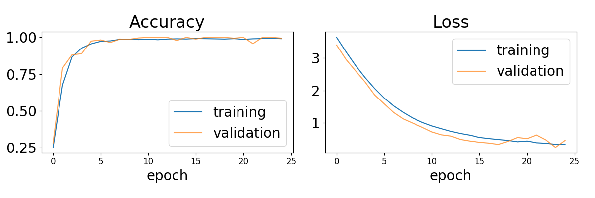
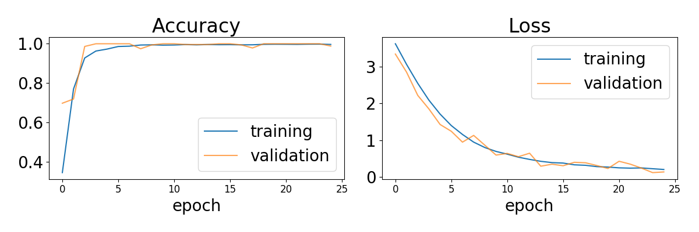

## An algorithm for detecting the pitch of a given audio track
<!-- ***Abhishek Nandekar, Dr.Nithin Nagaraj***    
*National Institute of Advanced Studies, Bengaluru, 560012* -->

### Introduction

Pitch is a fundamental feature for the production of music, and extracting instantaneous pitch of an audio signal can be helpful for defining the melody of the signal, which can further help in identifying melodic patterns in a song. Such melodic patterns have been used for devising a feature set[^MiningPatterns] useful for mathematically modelling rāgas in Indian Classical Music as vector spaces[^ragaVector].  

In Indian Classical Music, compositions are built upon a melodic framework called the *ra&#772;ga*. This melodic framework is defined by a set of svaras, which are roughly the same pitches we identify here, but may or may not have a defined frequency. The use of pitch distribution based tonal features is a widely popular approach for ra&#772;ga classification. Detecting the pitch of an audio composition is fundamental for finding the pitch distribution of that composition[^pd1], [^pd2], [^pd3]. Pitch detection is also the basis of Automatic Music Transcription(AMT), which is a popular method for music generation.

Pitch is analogous to _primary colours_ (red, yellow and blue) in painting. It is the building block of a song's melody. A pitch can be separated into two components, which are referred to as **tone height** and **chroma**. The tone height refers to the octave number and the chroma to the respective pitch spelling attribute contained in the set {C, C♯, D, $\dots$, B}.

### Techniques Used

#### Short Time Fourier Transform(STFT)

As explained in [^mller_2016], let $x:\mathbb Z\rightarrow \mathbb R$ be a real valued discrete-time signal obtained by equidistant sampling with respect to a fixed sampling rate $f_s$. Let $w:[0: N-1] \rightarrow \mathbb R$ be the sampled window function, such that $N \in \mathbb N$. In case of a rectangular window,

$$\begin{aligned}
w(n) :=
\begin{cases}
1, ~~~\forall n \in [0, N-1] \\\\\\
0, \text{ otherwise}
\end{cases}
\end{aligned}$$

Here, $N$ is also useful for determining the window length($N/f_s$). There exists another parameter, $H \in \mathbb N$, known as the **hop size**. This is the step size, in which the window is shifted across the signal.  

##### Discrete STFT

$$\tag{i}
        \chi (m, k) := \sum_{n=0}^{N-1} x(n+mH)w(n) \exp{\bigg(\frac{-2\pi i kn}{N}\bigg)}
        \label{eq: STFT}
      $$  

where, $\chi(m, k)$ is the $k^{th}$ Fourier
coefficient for the $m^{th}$ time frame. Here, $m \in \mathbb Z$ and $k \in [0:K]$. Assuming $N$ is even, $K=N/2$ is the frequency index corresponding to the Nyquist frequency.

**Spectral Vector:**
: A vector of
size $K+1$ given by the coefficients $\chi(m, k)$ $\forall k$
$\in [0, K]$, for a fixed $m$. The computation of each spectral vector
leads to a Discrete Fourier Transform of size N.

Each Fourier coefficient $\chi(m, k)$ is associated with a physical time position,  
$$\begin{aligned}
        T_{coef}(m) := \frac{m \cdot H}{f_s} \text{ seconds}
    \end{aligned}$$

if $H=1$, we end up obtaining a specified vector for each sample of the DT signal $x(n)$, resulting in a huge increase in data volume. One often chooses $H=N/2$ to get a good trade-off between a reasonable temporal resolution and data volumes.

The index $k$ of $\chi(m, k)$ corresponds to the physical frequency,  
$$\begin{aligned}
        F_{coef}(k) := \frac{k\cdot f_s}{N} \text{ Hz}
    \end{aligned}$$

#### Constant Q-Transform(CQT)

Constant Q-Transform(CQT) is a technique that transforms the discrete-time-signal $x(n)$ into the time-frequency domain such that the center frequencies
of the frequency bins are geometrically spaced and their Q-factors are all equal. It is essentially a wavelet transform with high Q-factors, such as 12-96 bins per octave. For a more detailed explanation, refer [^Schrkhuber2010CONSTANTQTT].

Here, every frequency bin has a different window length $N_k$. $w(n)$ is the window function, and $H$ is the hop-size.  

$$
\begin{equation*}
\tag{ii}
\chi_{CQ}(k, n) := \sum_{j = n - \lfloor N_k/2 \rfloor}^{n + \lfloor N_k/2 \rfloor} x(j)\cdot a_k^{*}(j - n + N_k/2)
\end{equation*}
$$  

where, $k \in [1:K]$ is the frequency bin index,
and $a_k^{*}$ is the complex conjugate of $a_k$, also known as the "time-frequency atom", defined as,  
$$\begin{aligned}
a_k(n) := \frac{1}{N_k}w(\frac{n}{N_k})\exp{
\bigg(-i2\pi n \frac{f_k}{f_s}\bigg)}\end{aligned}$$  
where, $f_k$ is the center frequency of the $k^{th}$ bin, $f_s$ is the sampling rate.
$N_k \in \mathbb R$ are the window lengths, and are inversely proportional to $f_k$, in order to have the same Q-factor for
all the bins.

Here,  
$$\begin{aligned}
f_k := f_1\cdot 2^{\frac{k-1}{B}}  \end{aligned}$$  
where, $f_1$ is the centre frequency for the lowest frequency bin, $B$ is the number of bins per octave.

Then, the Q-factor for each bin($Q_k$) is defined as,  
$$\begin{aligned}
Q_k := \frac{f_k}{\Delta f_k} = \frac{N_k f_k}{\Delta\omega f_s}\end{aligned}$$  

where, $\Delta f_k$ is -3 dB bandwidth frequency response of the atom $a_k(n)$, and, $\Delta\omega$ is -3 dB bandwidth of the mainlobe of the spectrum of the window function $w(n)$.

Since $Q_k$'s are constant for all the frequency bins, we can just call it $Q$.

Selecting a low value for $Q$ leads to frequency smearing, since $\Delta f_k$ for each bin is high. But on the other hand, selecting a very high value for $Q$ has a consequence that the portion of the spectrum between the bins will not be analysed.

Hence, optimal value of $Q$ is calculated as,  
$$\begin{aligned}
Q = \frac{q}{\Delta\omega (2^{1/B} - 1)}\end{aligned}$$  

where $q$ is known as the scaling factor, $0 < q \leq 1$. Usually, $q$ is chosen to be 1. $q < 1$ can be used to improve the time-resolution at the cost of degrading the frequency resolution. The above equation can be substituted in the definition of $Q$ and can be solved for $N_k$ to
obtain,  
$$\begin{aligned}
N_k = \frac{qf_s}{f_k(2^{1/B} - 1)}\end{aligned}$$  
To enable signal reconstruction from the CQT coefficients, successive atoms can be placed $H_k$ samples apart(Hop Size). Typically, $0<H_k\leq\frac{1}{2}N_k$

### Methodology

This experiment is essentially a reproduction of one of the methods discussed in [^dl4mir]. The training data set is a synthesised one.

In the original research, the training set is a pure sinusoid on 12 different pitches (one octave), starting from 440Hz. A **Constant Q-Transform (CQT)** is computed for each signal in the set. The first frame is chosen, and its power-output is converted into **the deciBel(dB) scale**. The vector is then normalised and fed to the network.

In our experiment, a set of pure sine waves over a wider range of pitches (4 octaves or 48 pitches) is used as the training data. A magnitude-CQT is computed in one iteration of the experiment, while, a magnitude-STFT is computed in the other. We then choose the first frame of the output vector, normalise the values and feed it to the network. We skip the _power conversion to deciBel_ step, since it's inclusion was **heavily reducing the training accuracy.**

#### Training Model

The training model used in this experiment is fairly simple. There is only a single dense hidden layer, with no bias, which connects the $n$ dimensional input to 48 dimensional output. Here,

$$
\begin{aligned}
n = \begin{cases}
84, ~~\text{CQT} \\\\\\
1025, ~~ \text{STFT}
\end{cases}
\end{aligned}  
$$

By computing a CQT or STFT, we are essentially computing the power distributed over each of the $n=84$ frequency bins (or $n=1025$ Fourier coefficients) in each frame, as explained above. But since we are choosing the result of only the first frame, we can represent a single input with a $1 \times n$ vector.

This means that each input is mapped to the output by a $n \times 48$ dimensional weight matrix $\textbf{W}$, such that each $w_{ij} \in \textbf{W},~i\in[1:n],~j\in[1:48]$ represents the weight of each frequency-bin/Fourier coefficient for each of the 48 notes in the output. **Training** is the process of tuning these $w_{ij}$'s such that they  point to the right output for any given pitch.

The model uses the **Stochastic Gradient Descent(SGD)** optimiser, with **softmax** activation  and **categorical crossentropy** loss[^dlbook].

The softmax function:
  : The simplest definition of a softmax function:   
  $$\tag{iii}
  \sigma(\textbf{x})_i = \frac{e^{x_i}}{\sum_{j=1}^K e^{x_j}}, ~ i\in [1:K], ~\textbf{x} = (x_{[1:K]})  
  $$  

In our case, $K=48$.

The validation set is generated by the same class that generated the data set. Since the data is synthetically generated, cross-validation was not necessary.

### Results

After the training process, the results obtained are as follows:

#### CQT

**CQT** here refers to the experiment where the CQT was computed for the synthesised data before training.
{{}} Training loss and accuracy for the CQT experiment 
<!--  -->

In the above image, the validation set loss is similar to the training loss, which implies there's no overfitting. The final accuracy was **1.0**, and loss was **0.2**.     

#### STFT

This refers to the experiment where the STFT was computed for the synthesised data before training.
{{}} Training loss and accuracy for the STFT experiment. 
<!--  -->

Here too, the validation loss is almost similar to the training loss, implying no overfitting. The final accuracy was **0.99** and loss was **0.35**

#### Testing

For testing purposes, the virtual instruments(VSTs) in Apple's Logic Pro X were used. These VSTs use **audio samplers** to emulate the sound  of a real instrument up till a great accuracy.

VSTs using audio samplers are created by recording a given instrument at every pitch and then applying some processing to glue the audio samples together.

The VSTs used in this experiment were different types of organs like the Church Organ, the Grand Organ, the Cathedral Organ, the Oakland Organ etc. Each organ played a random pitch for a duration of more than 1s. Hundred such samples were recorded and randomly shuffled, fifteen of which and used for testing. The results have been tabulated below:  

The testing is done as follows:   

1. For each audio clip, CQT or STFT is calculated(eq (i) or eq(ii)) and the first frame is chosen. As a result, we end up with a $1 \times n$ matrix $\vec{x}$.   

2. We then take the dot product of the $1 \times n$ matrix $\vec{x}$ with the $n \times 48$ matrix $\textbf{W}$ obtained via training.  
$$ \vec{y}' = \vec{x}~ \cdot~ \textbf{W} $$  

3. We then obtain the final output $1 \times 48$ vector $\vec{y}$ by taking the softmax(eq (iii)) of $\vec{y}'$.  
$$ \vec{y} = (\sigma(\vec{y}')_{[1:48]} )$$   

We call each value $y_i \in \vec{y}, ~ i\in[1:48]$ the **confidence score** of that pitch. the pitch with the highest confidence score $y_i$ is then returned as the detected pitch.

##### CQT Experiment
|Sr|Played Note| Detected Note| Confidence| Remarks |  
|:-:| :-----------: | :--------: | :-----------: | :---:|
|1|  C5 | G5 | 0.655 | Wrong detection |
|2|C3 | C3 | 0.826 | Perfect Detection |  
|3|empty audio| A2 | NaN | A2 is the lowest frequency our algorithm can detect |  
|4|F3 | F3 | 0.827 | Perfect Detection |  
|5|G#5 | G#5 | 0.247 | G#3 has been played in the beginning followed by C5 for most of the window. Confidence score is low because C5 is not a partial frequency of G#5|  
|6|C3 | C3 | 0.827 | Perfect Detection |  
|7| C3| C3 | 0.821 | Perfect Detection |
|8| C3 | C3| 0.828 | Perfect Detection |
|9| C4 | A#3 | 0.027 | Wrong Detection |
|10| G2 | G2 | 0.804 | Perfect Detection |
|11| A4 | E5 | 0.726 | E5 is a partial for A4. Probably the organ has a thick timbre, resulting in such a high confidence value|
|12|C3 | C3 | 0.823 | Perfect Detection |  
|13| B5 | B5 | 0.695 | Perfect Detection |
|14| G5, C5 | G5 | 0.677 | C5 has a much lower intensity here |  
|15|A&#9839;5 | A&#9839; | 0.754 | Perfect Detection |   

##### STFT Experiment
|Sr|Played Note| Detected Note| Confidence| Remarks |  
|:-:| :-----------: | :--------: | :-----------: | :---:|
|1|D&#9839;3 | D&#9839;3 | 0.865 | Perfect Detection |  
|2|C3 | C3 | 0.907 | Perfect Detection |  
|3| G5 | G5 | 0.737 | C5 is probably there due to the instrument timbre, which might be the reason of loss of confidence  |
|4| A5 | A5 | 0.506 | Again, E5 is also probably there due to the instrument timbre |  
|5| D2 | D2 | 0.851 | Perfect Detection |  
|6| B3 | B3 | 0.956 | Perfect Detection |  
|7| F2 | F2 | 0.627 | Perfect Detection; reason for the low confidence score is unknown |  
|8| C3 | C3 |  0.826 | Perfect Detection |  
|9| A5 | A5 | 0.507 | Randomised choice probably chose the same audio clip as (4) above |  
|10| D2 | D2 | 0.856 | Perfect Detection |
|11 | B3 | B3 | 0.956 | Perfect Detection |  
|12 | G2 | G2 | 0.861 | Perfect Detection |
| 13 | B3 | B3 | 0.907 | Perfect Detection |
| 14 | B3 | B3 | 0.921 | Perfect Detection |
| 15 | C3 | C3 | 0.907 | Perfect Detection |

### Conclusion:

The original research used **Constant Q-Transform** for transforming the audio and used synthetic data for the testing set. But as we can see, using **Short Time Fourier Transform** on the training set obtains a marginally less accurate but a more robust classification system, even on non-synthetic test variables.

[^MiningPatterns]: S.  Gulati,  J.  Serr`a,  V.  Ishwar,  and  X.  Serra.   Mining  melodic  patterns  inlarge  audio  collections  of  indian  art  music.   In2014 Tenth InternationalConference on Signal-Image Technology and Internet-Based Systems, pages264–271, 2014.

[^ragaVector]: S.  Gulati,  J.  Serr`a,  V.  Ishwar,  S. Sent ̈urk,  and  X.  Serra.   Phrase-based rĀga recognition using vector space modeling.  In2016 IEEE InternationalConference on Acoustics, Speech and Signal Processing (ICASSP),  pages66–70, 2016

[^dl4mir]: Keunwoo  Choi,  Gy ̈orgy  Fazekas,  Kyunghyun  Cho,  and  Mark  B.  San-dler.   A  tutorial  on  deep  learning  for  music  information  retrieval.CoRR,abs/1709.04396, 2017

[^mller_2016]: Meinard M ̈uller.Fundamentals of Music Processing – Audio, Analysis, Al-gorithms, Applications.  Springer Verlag, 2015
[^Schrkhuber2010CONSTANTQTT]: Christian Sch ̈orkhuber.  Constant-q transform toolbox for music process-ing.  2010

[^dlbook]: Ian Goodfellow, Yoshua Bengio, and Aaron Courville. 2016. Deep Learning. The MIT Press.

[^pd1]: V. Kumar, H. Pandya, and C. V. Jawahar.  Identifying ragas in indianmusic.  In2014 22nd International Conference on Pattern Recognition,pages 767–772, 2014.
[^pd2]: Ashwin  Bellur,  Vignesh  Ishwar,  Xavier  Serra,  and  Hema  Murthy.   Aknowledge  based  signal  processing  approach  to  tonic  identification  inindian classical music.  In2nd CompMusic Workshop, Istanbul, Turkey,12/07/2012   
[^pd3]: K. C. Waghmare and B. A. Sonkamble.  Analyzing acoustics of indianmusic audio signal using timbre and pitch features for raga identification.In2019 3rd International Conference on Imaging, Signal Processing andCommunication (ICISPC), pages 42–46, 2019.
